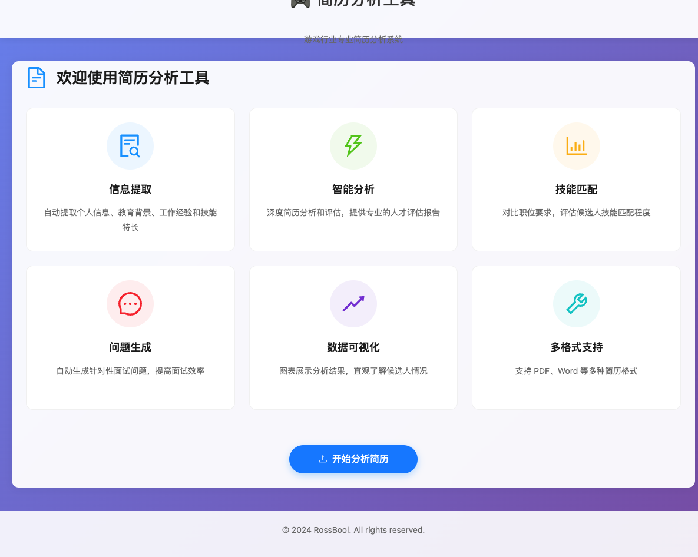
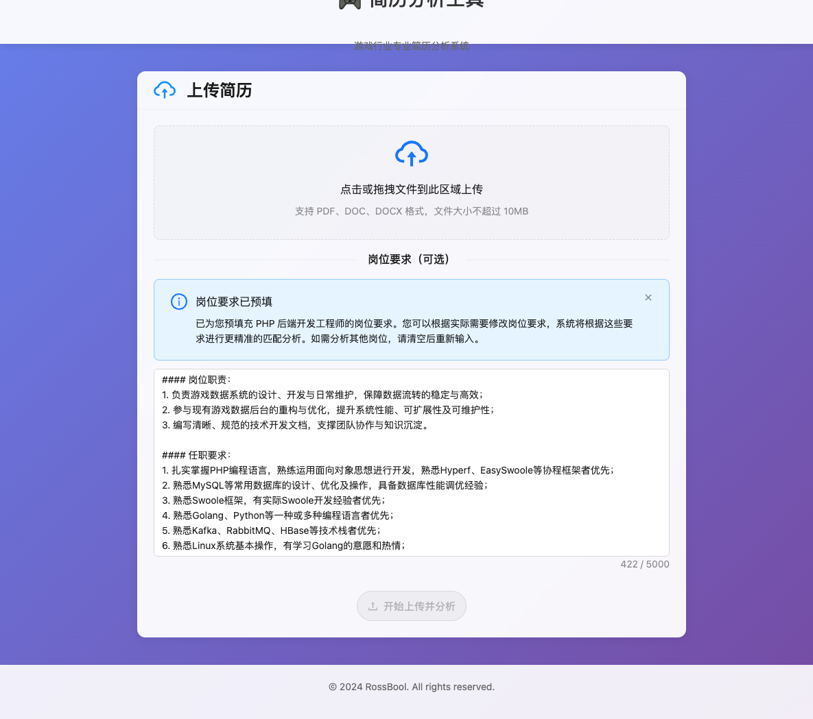

# 简历分析工具 (Resume Analyzer)

游戏行业专用的简历分析工具，帮助面试官快速评估候选人的技能、经验和潜力。

## 技术栈

### 后端
- **PHP 8.3** - 核心语言
- **Workerman** - 高性能 PHP 服务框架
- **Symfony HttpClient** - HTTP 客户端

### 前端
- **Vue 3** - 渐进式框架
- **Ant Design Vue 4** - 企业级 UI 组件库
- **Vite** - 下一代前端构建工具
- **Pinia** - Vue 状态管理
- **Axios** - HTTP 客户端

## 功能特性

1. **信息提取** - 个人信息、教育背景、工作经验、技能特长
2. **技能匹配** - 智能评估匹配度，标注缺失技能
3. **经验分析** - 游戏行业经验深度评估
4. **教育评估** - 学历和专业相关性分析
5. **成就识别** - 识别关键成就和贡献
6. **潜力预测** - 综合评估发展潜力（优势/不足）
7. **报告生成** - 个性化分析报告
8. **数据可视化** - 统计图表和标签云展示
9. **问题生成** - 自动生成针对性面试问题
10. **多格式支持** - PDF、DOC、DOCX 全支持

## 界面预览

### 首页


### 上传页


## 快速开始

### 1. 环境要求

- PHP 8.3+ (`php83` 命令)
- Node.js 18+
- pnpm

### 2. 安装依赖

**后端：**
```bash
cd backend
php83 /opt/homebrew/bin/composer install
```

**前端：**
```bash
cd frontend
pnpm install
```

### 3. 配置环境

复制环境变量模板并编辑：
```bash
cp backend/.env.example backend/.env
```

编辑 `backend/.env`：
```env
# 数据库配置（可选）
DB_CONNECTION=mysql
DB_HOST=127.0.0.1
DB_PORT=3306
DB_DATABASE=resume_analyzer
DB_USERNAME=root
DB_PASSWORD=

# 文件上传配置
UPLOAD_MAX_SIZE=10485760
ALLOWED_FILE_TYPES=pdf,doc,docx
```

创建数据库（如需持久化存储）：
```sql
CREATE DATABASE resume_analyzer CHARACTER SET utf8mb4 COLLATE utf8mb4_unicode_ci;
```

### 4. 启动服务

**后端服务（端口 8787）：**
```bash
cd backend
php83 -S localhost:8787 -t public public/router.php
```

**前端服务（端口 3000）：**
```bash
cd frontend
pnpm run dev
```


### 5. 访问应用

打开浏览器访问：**http://localhost:3000**

## 项目结构

```
rg-resume-analyzer.rossbool.com/
├── backend/                    # 后端 (PHP 8.3)
│   ├── app/
│   │   ├── Controller/        # 控制器
│   │   └── Service/           # 业务逻辑
│   │       └── ResumeAnalyzer.php     # 简历分析
│   ├── public/
│   │   ├── router.php         # 路由器
│   │   └── uploads/           # 上传目录
│   ├── config/                # 配置文件
│   ├── .env                   # 环境变量
│   └── composer.json          # PHP 依赖
│
└── frontend/                   # 前端 (Vue 3 + Ant Design)
    ├── src/
    │   ├── components/        # 组件
    │   │   └── SkillCharts.vue      # 统计图表
    │   ├── views/            # 页面
    │   │   ├── Home.vue             # 首页
    │   │   ├── Upload.vue           # 上传页
    │   │   └── Result.vue           # 结果页
    │   ├── stores/           # Pinia 状态管理
    │   ├── api/              # API 接口
    │   ├── router/           # 路由配置
    │   ├── App.vue           # 根组件
    │   └── main.js           # 入口文件
    ├── package.json          # Node 依赖
    └── vite.config.js        # Vite 配置
```

## 使用说明

### Web 界面使用

1. **上传简历**
   - 点击"开始分析简历"
   - 拖拽或选择 PDF/Word 文件
   - 文件大小限制：10MB

2. **查看分析**
   - 自动解析简历内容
   - 查看个人信息、教育、工作经验
   - 查看技能匹配度和发展潜力评分

3. **生成面试问题**
   - 点击"生成问题"按钮
   - 生成针对性面试问题
   - 查看问题目的和考察要点

### API 调用

```bash
# 健康检查
curl http://localhost:8787/api/health

# 上传简历
curl -X POST http://localhost:8787/api/resume/upload \
  -F "resume=@resume.pdf"

# 分析简历
curl -X POST http://localhost:8787/api/resume/analyze \
  -H "Content-Type: application/json" \
  -d '{"file_path":"/uploads/resume_xxx.pdf"}'

# 生成面试问题
curl -X POST http://localhost:8787/api/resume/questions \
  -H "Content-Type: application/json" \
  -d '{"analysis":{...}}'
```

## 文档

- **[快速开始](./QUICK_START.md)** - 快速使用指南
- **[重构报告](./ANT_DESIGN_REFACTOR.md)** - Ant Design Vue 重构详情
- **[安装部署](./INSTALL.md)** - 生产环境部署指南
- **[项目总结](./PROJECT_SUMMARY.md)** - 完整项目总结
- **[CLAUDE.md](./CLAUDE.md)** - 项目架构说明

## 依赖说明

### 后端主要依赖
- `workerman/webman` - 核心 Web 框架
- `symfony/http-client` - HTTP 客户端
- `symfony/mail` - 邮件发送
- `phpoffice/phpword` - Word 文件处理
- `smalot/pdfparser` - PDF 文件解析
- `vlucas/phpdotenv` - 环境变量管理

### 前端主要依赖
- `vue@^3.4.0` - Vue 3 核心框架
- `vue-router@^4.2.0` - 路由管理
- `pinia@^2.1.0` - 状态管理
- `ant-design-vue@^4.2.0` - UI 组件库
- `axios@^1.6.0` - HTTP 客户端
- `marked@^11.0.0` - Markdown 渲染
- `html2pdf.js@^0.10.0` - PDF 生成
- `mammoth@^1.6.0` - Word 文档解析

## 架构设计

### 系统架构
```
用户浏览器
    ↓
前端 (Vue 3 + Vite) → 端口 3000
    ↓ (HTTP/Axios)
后端 API (PHP 8.3 + Workerman) → 端口 8787
```

### 数据流
1. **文件上传**: 用户上传简历 → 前端验证 → 后端接收 → 文件存储
2. **内容解析**: 后端读取文件 → 提取文本内容 → 返回前端
3. **分析处理**: 后端处理数据 → 结构化结果 → 存储返回
4. **结果展示**: 前端接收数据 → 渲染组件 → 可视化展示

### 安全特性
- ✅ 文件类型白名单验证
- ✅ 文件大小限制（10MB）
- ✅ 环境变量隔离敏感信息
- ✅ CORS 跨域保护
- ✅ 输入数据验证和清理
- ✅ 错误信息脱敏处理

## 性能优化

### 前端优化
- **代码分割**: Vite 自动分包，按需加载
- **组件懒加载**: 路由级别的懒加载
- **资源压缩**: 生产环境自动压缩
- **缓存策略**: 静态资源长期缓存

### 后端优化
- **文件处理**: 流式处理大文件
- **API 响应**: JSON 格式化输出
- **错误处理**: 优雅降级机制
- **并发处理**: Workerman 异步支持

## 生产部署

### 推荐配置

**Nginx 反向代理配置示例：**
```nginx
server {
    listen 80;
    server_name resume.example.com;

    # 前端静态文件
    location / {
        root /path/to/frontend/dist;
        try_files $uri $uri/ /index.html;
    }

    # 后端 API
    location /api/ {
        proxy_pass http://127.0.0.1:8787;
        proxy_set_header Host $host;
        proxy_set_header X-Real-IP $remote_addr;
        proxy_set_header X-Forwarded-For $proxy_add_x_forwarded_for;
        proxy_set_header X-Forwarded-Proto $scheme;

        # 文件上传大小限制
        client_max_body_size 10M;
    }
}
```

**使用 Supervisor 管理后端服务：**
```ini
[program:resume-analyzer]
command=/opt/homebrew/bin/php83 -S 0.0.0.0:8787 -t /path/to/backend/public /path/to/backend/public/router.php
directory=/path/to/backend
autostart=true
autorestart=true
user=www-data
redirect_stderr=true
stdout_logfile=/var/log/resume-analyzer.log
```

### 部署检查清单
- [ ] 配置环境变量（`.env`）
- [ ] 设置正确的文件权限（`uploads/` 目录）
- [ ] 配置 HTTPS 证书
- [ ] 设置数据库（如需持久化）
- [ ] 配置日志轮转
- [ ] 设置监控和告警
- [ ] 配置备份策略

## 开发指南

### 添加新的分析维度
1. 在 `backend/app/Service/ResumeAnalyzer.php` 中添加分析逻辑
2. 更新前端组件以显示新数据
3. 更新 TypeScript 类型定义
4. 测试新功能

### 自定义 UI 主题
编辑 `frontend/src/style/index.css`:
```css
:root {
  --primary-color: #1890ff;
  --success-color: #52c41a;
  --warning-color: #faad14;
  --error-color: #f5222d;
}
```

## 技术亮点

### 后端
- ✅ PHP 8.3 最新特性
- ✅ Workerman 高性能框架
- ✅ 结构化分析引擎
- ✅ 容错处理机制
- ✅ RESTful API 设计
- ✅ 流式响应支持（SSE）

### 前端
- ✅ Ant Design Vue 企业级组件
- ✅ Vue 3 Composition API
- ✅ Pinia 状态管理
- ✅ 零额外图表依赖
- ✅ 响应式设计
- ✅ Markdown 渲染支持
- ✅ PDF 导出功能

### UI/UX
- ✅ 现代化卡片设计
- ✅ 拖拽上传体验
- ✅ 统计数据可视化
- ✅ 流畅动画效果
- ✅ 加载状态反馈
- ✅ 错误提示优化

## 开发命令

```bash
# 后端
cd backend
php83 -S localhost:8787 -t public public/router.php  # 启动开发服务器

# 前端
cd frontend
pnpm run dev          # 启动开发服务器
pnpm run build        # 构建生产版本
pnpm run preview      # 预览生产构建
```

## 常见问题

### 安装和环境

**Q: Composer 安装依赖失败？**
A: 尝试以下解决方案：
```bash
# 清除 Composer 缓存
php83 /opt/homebrew/bin/composer clear-cache

# 使用国内镜像
php83 /opt/homebrew/bin/composer config -g repo.packagist composer https://mirrors.aliyun.com/composer/

# 重新安装
php83 /opt/homebrew/bin/composer install
```

**Q: pnpm 安装速度慢？**
A: 使用国内镜像：
```bash
pnpm config set registry https://registry.npmmirror.com
```

**Q: PHP 版本不正确？**
A: 确保 PHP 8.3 已安装并在 PATH 中：
```bash
# 检查版本
php83 --version

# 如需设置默认版本
alias php=php83
```

### 功能使用

**Q: 上传文件失败？**
A: 检查以下几点：
- 文件大小是否超过10MB
- 格式是否为 PDF/DOC/DOCX
- 浏览器控制台是否有错误信息
- `backend/public/uploads/` 目录权限是否正确

**Q: 分析失败？**
A: 确认以下几点：
- 后端服务正常运行
- 简历文件格式正确
- 查看后端日志获取详细错误信息

**Q: 前端无法连接后端？**
A: 检查：
- 后端服务是否运行在 8787 端口：`lsof -i:8787`
- 前端 API 配置是否正确：`frontend/src/api/resume.js`
- 浏览器控制台的网络请求状态

**Q: 图表不显示？**
A: Ant Design 统计组件无需额外依赖：
- 检查浏览器控制台错误
- 确认数据格式正确
- 检查 Ant Design Vue 版本是否为 4.x

**Q: PDF 导出失败？**
A: 常见原因：
- 浏览器安全策略限制（尝试在本地服务器环境下使用）
- 内容过长导致超时（尝试分段导出）
- html2pdf.js 依赖未正确安装

### 性能问题

**Q: 分析速度慢？**
A: 优化建议：
- 检查网络延迟
- 优化简历文件大小
- 启用后端缓存机制

**Q: 前端加载慢？**
A: 优化措施：
- 生产环境使用 `pnpm run build`
- 启用 CDN 加速
- 检查浏览器缓存策略
- 使用代码分割减少初始加载体积

### 数据和隐私

**Q: 上传的简历会被保存吗？**
A: 取决于配置：
- 开发环境：文件保存在 `backend/public/uploads/` 目录
- 生产环境：建议定期清理或使用对象存储
- 分析结果不会永久存储数据

**Q: 如何保护简历隐私？**
A: 推荐做法：
- 使用 HTTPS 传输
- 定期清理上传文件
- 配置文件访问权限
- 不在日志中记录敏感信息

### 开发调试

**Q: 如何查看后端日志？**
A: PHP 内置服务器会在终端输出日志，或使用：
```bash
# 实时查看日志
php83 -S localhost:8787 -t public public/router.php 2>&1 | tee backend.log
```

**Q: 如何调试前端问题？**
A: 使用浏览器开发者工具：
- F12 打开开发者工具
- Console 面板查看错误
- Network 面板查看 API 请求
- Vue DevTools 扩展调试组件状态

## 贡献

欢迎提交 Issue 和 Pull Request！

### 开发规范
- 遵循 PSR-12 代码规范（PHP）
- 遵循 Vue.js 风格指南
- 提交前运行测试和代码检查
- 编写清晰的提交信息

## 更新日志

### v1.0.0 (2024-01)
- ✨ 初始版本发布
- ✅ 完成核心简历分析功能
- ✅ 前端使用 Ant Design Vue 重构
- ✅ 支持 PDF 和 Word 文件
- ✅ 数据可视化和报告生成

## 路线图

### 计划功能
- [ ] 支持更多简历格式（TXT、图片 OCR）
- [ ] 批量简历分析
- [ ] 简历对比功能
- [ ] 面试评估记录
- [ ] 数据库持久化存储
- [ ] 用户权限管理
- [ ] 多语言支持（英文/日文）
- [ ] 导出更多格式（Word、Excel）
- [ ] 简历模板库
- [ ] API 限流和缓存优化

### 长期规划
- [ ] 更多游戏行业专项分析
- [ ] 企业级部署方案
- [ ] 移动端适配
- [ ] 插件系统

## 相关资源

### 技术文档
- [Workerman 文档](https://www.workerman.net/docs/workerman/)
- [Vue 3 文档](https://cn.vuejs.org/)
- [Ant Design Vue 文档](https://antdv.com/)

### 工具推荐
- **API 测试**: Postman, Insomnia
- **数据库管理**: phpMyAdmin, DBeaver
- **代码编辑器**: PhpStorm, VS Code
- **版本控制**: Git, GitHub
- **监控**: New Relic, Datadog

## 许可证

Copyright © 2024 RossBool. All rights reserved.

---

## 项目状态

**当前版本：** v1.0.0

**开发状态：** ✅ 生产就绪

**技术栈：**
- 后端：PHP 8.3 + Workerman
- 前端：Vue 3 + Ant Design Vue

**核心功能：**
- ✅ 简历文件解析（PDF/Word）
- ✅ 智能分析
- ✅ 技能匹配评估
- ✅ 面试问题生成
- ✅ 数据可视化展示
- ✅ PDF 报告导出

**适用场景：**
- 游戏行业招聘面试
- 简历初步筛选
- 技能匹配评估
- 面试问题准备

**快速开始：**
```bash
# 克隆项目
git clone <repository-url>

# 安装依赖（后端）
cd backend && php83 /opt/homebrew/bin/composer install

# 安装依赖（前端）
cd frontend && pnpm install

# 配置环境
cp backend/.env.example backend/.env

# 启动服务
# 终端 1: cd backend && php83 -S localhost:8787 -t public public/router.php
# 终端 2: cd frontend && pnpm run dev

# 访问应用
# http://localhost:3000
```

**支持与反馈：**
- 📧 邮件：support@rossbool.com
- 📚 文档：查看项目根目录的 `.md` 文件
- 🐛 问题反馈：提交 Issue

---

<div align="center">

**⭐ 如果这个项目对你有帮助，请给个 Star！**

Made with ❤️ by RossBool Team

</div>
